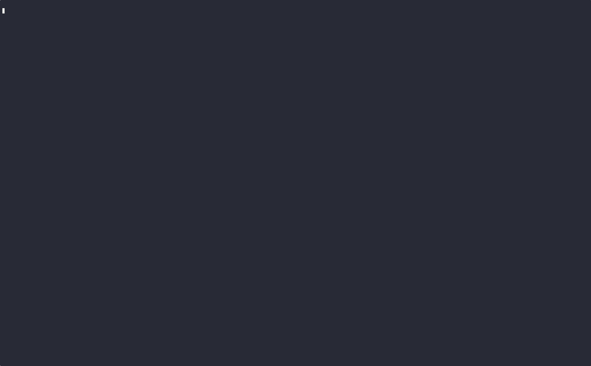

# Go Fireworks

An audio-reactive terminal fireworks show written in Go using tcell for terminal rendering and using go-particle and real-time audio analysis.




## Features

- Beautiful braille-based particle effects
- Real-time audio reactivity (responds to music playing on your system)
- Bass-triggered firework explosions
- Volume-influenced particle counts
- Frequency-based color selection
- Smooth physics simulation with gravity and air resistance
- Live audio visualization bars

## Audio Reactivity

The fireworks respond to system audio in four primary ways:

- **Volume** → **Color**: Louder sounds cycle through brighter colors
- **Pitch** (dominant frequency) → **Speed**: Higher pitched sounds create faster-moving particles
- **Rolling Average** (smoothed volume) → **Size**: Sustained loud sounds create larger explosions with more particles
- **Energy** (spectral energy) → **Density**: Higher overall energy increases the number of particles on screen by spawning fireworks more frequently

Additionally:
- **Bass peaks** trigger new firework explosions
- **Instant volume spikes** can also trigger explosions

## Requirements

- Go 1.21+
- PulseAudio or PipeWire (for audio capture)
- Terminal with Unicode/braille character support

## Installation & Running

### Using Nix (recommended)

```bash
# Build and run
nix run

# Or build first
nix build
./result/bin/go-fireworks

# Development shell
nix develop
```

### Using Go directly

```bash
# Install dependencies
go mod download

# Run
go run *.go

# Build
go build -o go-fireworks
./go-fireworks
```

### Using Make

```bash
make run       # Build and run
make nix-run   # Run with Nix
make build     # Build only
```

## Controls

- **ESC** or **Q**: Exit the show
- **D**: Toggle debug mode (shows audio values, firework stats, and effect mappings)

## Debug Mode

Press **D** to toggle debug information that displays:

**Audio Data:**
- Volume, Pitch, Rolling Average, Energy, Bass (with 4 decimal precision)
- Last bass peak value

**Firework Statistics:**
- Total fireworks on screen
- Number of rockets launching
- Number of exploded fireworks
- Total particle count

**Effects Mapping:**
- Quick reference showing which audio feature controls which visual effect

This is helpful for understanding how the music affects the fireworks in real-time.

## How It Works

The application:

1. Captures system audio output using `pacat` (PulseAudio/PipeWire monitor)
2. Performs FFT (Fast Fourier Transform) analysis on audio samples
3. Extracts audio features:
   - Frequency band energies (bass, mid, high)
   - Overall volume (RMS)
   - Dominant frequency (pitch)
   - Rolling average of volume over time
   - Spectral energy (combined energy across all frequencies)
4. Maps audio features to firework properties:
   - **Volume** → Color selection (cycles through color palette)
   - **Pitch** → Particle speed (high pitch = fast particles)
   - **Rolling average** → Particle count/explosion size
   - **Energy** → Spawn rate/particle density (high energy = more fireworks on screen)
   - **Bass peaks** → Trigger new explosions
5. Renders particles using braille Unicode characters for detailed effects
6. Displays real-time audio levels and their effects on screen

## Audio System Compatibility

The application auto-detects your audio system and works with:

- PulseAudio
- PipeWire (via PulseAudio compatibility layer)

If no audio system is detected, the fireworks will still display with automatic random timing.

## Using as a Library

Go Fireworks can be integrated into your own applications. The packages are designed to be modular and reusable.

### Installation

```bash
go get github.com/timlinux/go-fireworks
```

### Packages

| Package | Description |
|---------|-------------|
| `go-fireworks/pkg/particles` | Particle physics system with collision detection |
| `go-fireworks/pkg/fireworks` | Fireworks show management and audio-reactive spawning |
| `go-fireworks/pkg/audio` | Real-time audio capture and FFT analysis |

### Example: Basic Fireworks Show

```go
package main

import (
    "time"

    "github.com/timlinux/go-fireworks/pkg/audio"
    "github.com/timlinux/go-fireworks/pkg/fireworks"
)

func main() {
    // Create a fireworks show for an 80x24 terminal
    show := fireworks.NewShow(80, 24)

    // Optional: customize configuration
    config := fireworks.DefaultConfig()
    config.Gravity = 3.0           // Heavier particles
    config.MaxParticles = 50       // More particles per explosion
    show.Config = config

    // Start audio analysis (optional - works without audio too)
    analyzer := audio.NewAnalyzer()
    analyzer.Start()
    defer analyzer.Stop()

    // Main loop
    lastUpdate := time.Now()
    for {
        now := time.Now()
        dt := now.Sub(lastUpdate).Seconds()
        lastUpdate = now

        // Get audio data (or use empty audio.Data{} if no audio)
        audioData := analyzer.GetData()

        // Spawn fireworks based on audio or randomly
        if shouldSpawn, count := show.ShouldSpawn(audioData, analyzer.IsEnabled()); shouldSpawn {
            for i := 0; i < count; i++ {
                show.CreateFirework(audioData)
            }
        }

        // Update physics
        show.Update(dt)

        // Render particles (integrate with your renderer)
        for _, rocket := range show.GetLaunchingRockets() {
            // Draw rocket at (rocket.RocketX, rocket.RocketY)
            _ = rocket
        }
        for _, particle := range show.GetAllParticles() {
            // Draw particle at (particle.X, particle.Y) with particle.Color
            _ = particle
        }

        time.Sleep(50 * time.Millisecond)
    }
}
```

### Example: Standalone Particle System

```go
package main

import (
    "github.com/timlinux/go-fireworks/pkg/particles"
)

func main() {
    // Create a particle system
    ps := particles.NewParticleSystem(80, 24)

    // Customize physics (optional)
    ps.Config.Gravity = 5.0
    ps.Config.Decay = 0.99

    // Create an explosion
    explosion := particles.CreateExplosion(40, 12, particles.ExplosionConfig{
        NumParticles: 30,
        Speed:        15.0,
        Type:         particles.ExplosionRadial,
        Color:        0xFF0000, // Red
        Char:         '⠁',
    })
    ps.AddParticles(explosion)

    // Update loop
    dt := 0.05 // 50ms timestep
    for ps.ActiveCount() > 0 {
        ps.Update(dt)

        // Render each particle
        for _, p := range ps.Particles {
            if p.Life > 0 {
                // Draw at (p.X, p.Y) with color p.Color
                _ = p
            }
        }
    }
}
```

### Explosion Types

The library supports multiple explosion patterns:

- `ExplosionRadial` - Classic circular burst
- `ExplosionDirectional` - Cone-shaped in a specific direction
- `ExplosionSideways` - Horizontal spread
- `ExplosionSpiral` - Rotating spiral pattern

## Development

The project consists of:

- `main.go`: Fireworks rendering and tcell integration
- `pkg/audio/`: Audio capture and FFT analysis
- `pkg/fireworks/`: Fireworks show management
- `pkg/particles/`: Particle physics engine
- `flake.nix`: Nix build configuration
- `Makefile`: Convenience build targets

## License

MIT
